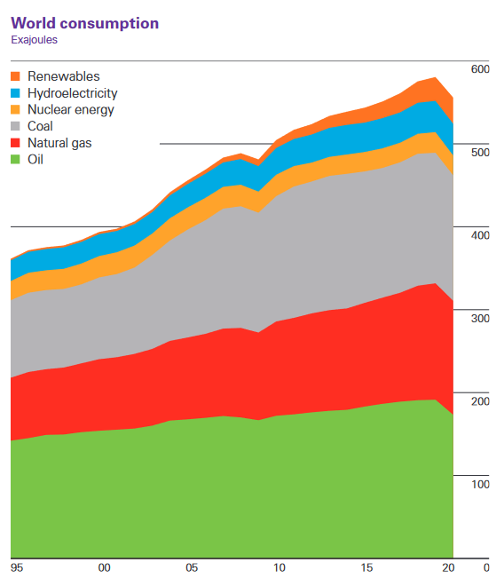

This is my first week of sharing what I'm learning in my Global Sustainability Solutions MSc at the University of Exeter. 

## Satisfying human needs at low energy use

Using data from 106 countries for several indicators and multivariate regression, Vogel et al (1) show the relationship between energy consumed and need satisfaction (think decent living standards, good nutrition, shelter, education, minimum income) and how that is modified by socio-economic conditions like public service quality, electricity access, and democratic quality. Need satisfaction is highly dependent on energy usage up to a certain point but becomes saturated after a point: i.e. using more energy greatly improves your life as you get good food, lighting, healthcare, then you get reducing returns on using more energy. After you have a house and good job, most of the energy you consume after that is not necessarily for a need. The big point in this study is that you can increase the energy efficiency of satisfying needs depending on the moderating socioeconomic factors. It’s not just how much energy you use but how you use it to improve your life.  

The socioeconomic factors that improve your quality of life are income equality, democracy, electricity access, clean fuels, trade and public transport infrastructure, public health coverage. The things that make it worse are extractivism (basing economy on extracting resources from earth) and chasing economic growth beyond moderate limits of affluence (chasing perpetual economic growth in rich countries). So, the way to both provide a good quality of life for all people while staying within our planetary boundaries is by setting up good democratic and equal societies with appropriate public services and NOT striving for growing the economy forever. The study also has some estimates about the sustainable carbon budget per person and how doing using these improving factors can feasibly keeps all people within that.

This study was truly wild to me in showing that empirically there is a "good" way to have a society in order for all of us to live on the limited planet we have. It's not just electrifying and putting solar panels on houses and EVs; having a functioning democracy and a more economically equal society is also (potentially) a key component to our sustainable future. 

## Demand side changes

So far, most of the conversation on the sustainability transition has been around supply-side fixes to the climate crises - if we change all energy sources to green ones, we can continue living the way we are now (this idea is called green capitalism). However, the facts point to this not being a feasible reality yet. Renewable energy is rapidly growing, but our total energy demand is also growing so fast that we are still increasing our fossil fuel usage.

_Global energy consumption as of 2021. From the [BP Statistical Review of World Energy](https://www.bp.com/content/dam/bp/business-sites/en/global/corporate/pdfs/energy-economics/statistical-review/bp-stats-review-2021-full-report.pdf)._ 

The other side of this supply-demand equation is much less talked about in terms of combatting the climate crisis. Reducing our energy consumption on a wider scale is a viable (maybe required) pathway to reduce emissions, but no one is promoting that because there is an idea that more consumption is needed to continue growing the economy (or the GDP) which we use as a proxy for the success of society. This [twitter thread](https://threadreaderapp.com/thread/1415189267542904833.html) outlines it nicely. 

All of us (generalizing) are in the global 99th percentile of income and have energy usage far beyond the saturation point of need satisfaction. Should we be using GDP as a way to measure our success as a society?

_The top 10% by income are responsible for nearly half of all carbon emissions (2)._

## Inequality and its effects on environmental degradation

Societal inequality (income, racial, gender, etc) is correlated with negative outcomes in society (crime, health outcomes, infant mortality, literacy, drug addiction, etc) as well as higher levels of environmental degradation (see this [ted talk](https://www.ted.com/talks/richard_wilkinson_how_economic_inequality_harms_societies)). Inequality also interacts with environmental degradation (see _The Haves and the Have Nots_ (3)):
* When people do not perceive a situation as fair they are less likely to cooperate and abide by rules when sharing a resource (e.g. global climate agreements). 
* People aspire to increase social status and thus consume more for status (e.g. new cars, new fashion, eating more meat). 
* More powerful actors shape the rules in their favor at the cost of the losers (e.g. fossil fuel companies lobbying).

Thus, reducing inequality can be a force for fighting the climate crisis, and is potentially a condition for our success in agreement with Vogel et al. 

## References 
1. Vogel, J. et al. (2021) ‘Socio-economic conditions for satisfying human needs at low energy use: An international analysis of social provisioning’, Global Environmental Change, 69. Available at: https://doi.org/10.1016/j.gloenvcha.2021.102287. 
2. Chancel, L. (2022) ‘Global carbon inequality over 1990–2019’, Nature Sustainability 2022, pp. 1–8. Available at: https://doi.org/10.1038/s41893-022-00955-z.
3. Cushing, L. et al. (2015) ‘The Haves, the Have-Nots, and the Health of Everyone: The Relationship Between Social Inequality and Environmental Quality’, http://dx.doi.org/10.1146/annurev-publhealth-031914-122646, 36, pp. 193–209. Available at: https://doi.org/10.1146/ANNUREV-PUBLHEALTH-031914-122646.

