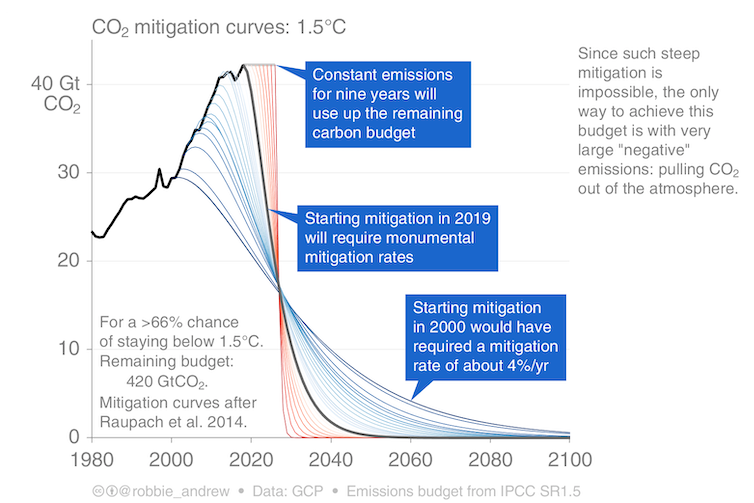

This is inspired by [this article](https://theconversation.com/climate-scientists-concept-of-net-zero-is-a-dangerous-trap-157368) by a number of academics that I read this week. Their position is that “net zero” is yet another way to ignore the serious and systemic change we need to do to avoid crisis. Net zero means we take as much carbon out of the air as we emit into it, meaning that the overall level will not increase. This implies that we could stop climate change by continuing to burn fossil fuels but offsetting it through tech or trees instead of simply stopping the use of fossil fuels. However,  none of the ways to do that have become actually feasible AND sustainable. 
At the Paris COP (2015), we internationally agreed that a 1.5C (2.7F) increase in temperature would be dangerous, but most scientists do not think we are going to achieve that (we are now at ~1.2C (2.2 F) already and change isn’t happening fast enough). The argument in this article is that governments, leaders, and the scientific community are gaslighting us with "net zero by 2050 will solve it" because we absolutely are not on track to meet 1.5C (see graph below which illustrates how steeply we have to drop our emissions that we’ve waited until this point vs. if we had started long ago - this is even a few years old so it looks even worse at this point as we rapidly eat through the remaining budget).

	 
Lots of people now are jumping on all these ways of trying to keep us burning and making it “carbon neutral.” Here's a few I've learned about in various contexts so far.

## Direct air carbon capture (DAC)
This is literally sucking carbon out of the air with giant machines and chemical reactions. It's incredibly energy expensive and there's no technology available for widespread use yet. Not feasible in the time we need it. 

## Carbon capture and storage (CCS)
CCS is technology to capture the CO2 directly from the source of the fossil fuel burning site like a gas power plant and store it underground. Sounds great, but we've had operational CCS plants around the world since at least the 90s. This [study](https://doi.org/10.1021/acs.estlett.2c00296) estimated that 29 million tonnes of CO2 was captured in the year 2019. That sounds cool until you put it in the scope of all human emissions, which is around 40 billion tonnes of CO2 per year -- so CCS is taking care of a grand total of 0.07% of emissions. And this isn't going to scale up any time soon because it's technically very difficult and very site/geology specific. 

## Bioenergy Carbon Capture and Storage (BECCS)
BECCS is the same thing as CCS but with burning biomass (that means wood) for energy and capturing the released CO2. It is theoretically carbon neutral because the carbon in the plants was absorbed from the atmosphere already. It isn’t really in practice because unless you are burning trees that were expressly planted for this purpose, you’re taking carbon that was already stored in older trees, and then re-storing it, minus all the energy it took to cut the trees down, transport them, and build the power plant. This also ignores the damage from deforesting that releases carbon stored in the soil and damage to biodiverse ecosystems. Additionally, it's impractical because it would require a HUGE amount of land to grow all these trees and would displace our food agriculture land.

## Solar radiation management (SRM)
SRM is a geoengineering idea that focuses not on removing carbon from the atmosphere but instead turning down the power on the incoming solar energy so that the greenhouse gases are trapping less heat, essentially putting an umbrella over the greenhouse. While some people have suggested things like putting giant mirrors into orbit around Earth to be a physical umbrella, the most talked about option in the near-term is a chemical umbrella via sulphate aerosols (particles in the air). 
Sulphate aerosols occur naturally when volcanic eruptions force them up into the stratosphere. Aerosols are reflective and prevent some solar energy from entering the lower parts of the atmosphere. They stay up there for a year or two, and work really well during that time – when Mt. Pinatubo erupted in the 90s, the earth cooled by about 0.5C (0.9F) for a few years.
So the pro-SRM crowd thinks that realistically, there is no way we are going to get our act together to prevent 2C (3.6F) of warming – our lifestyles and governments can’t/won’t change in time. Putting aerosols in the stratosphere can counteract some of the warming thanks to CO2 (could potentially counteract all of it?). The ideal scenario put forth is that SRM buys us some time to get our act together and reduce our emissions and take CO2 out of the atmosphere while keeping temperatures at “safe” levels– like in the graph below. Once we had sufficiently reduced the CO2 in the atmosphere we could stop using SRM. 
In theory, sounds pretty cool! Aerosols are relatively short-lived, so we could stop whenever we wanted. Here's rhe fine print: 
* Aerosols are extremely bad for human health. The aerosols will eventually come down out of the stratosphere (counterargument: we already emit so many aerosols that it doesn’t matter), and effects on the health of things besides humans are less known.
* SRM will drastically change precipitation patterns – it could destabilize monsoons and cause flooding or droughts, especially in Asia + Africa (the places that already have not much say in what’s happening emissions-wise). We don’t fully know what will happen but there is lots of modeling being done on it.
* Who is going to be in charge of putting the aerosols up there? Who will pay, who will decide when or how much to do it or when to stop? 
* There’s some question about how it might interact with the chemistry of the ozone which we already learned we don't want to destroy.
* It will ruin stargazing from earth :( 
* It will help with the temperature effects of CO2, but it will not stop the ocean acidifying from the CO2. 
* There are probably lots of domino effects that we have not thought about – this also is pretty difficult to test and has really not been tested in any realistic scale.
* If we do not reduce emissions and use SRM to prevent warming, if we were to suddenly stop doing SRM because e.g. some government of billionaire decided to stop paying for it, all the warming that we should have had will come all at once in a very short amount of time (<10 yrs), which would be even worse than having it come more gradually. 
In theory, I don’t think the idealized scenario of using SRM for a very short amount of time to prevent catastrophic warming is the worst idea in the world – but it seems like a very very risky alternative to decarbonizing. 

All of these technologies are being touted as potential technological fixes, but they are really bad band-aids or straight up not feasible upon closer inspection. Maybe we should do the most obvious and safest solution which we have known about for decades: stop burning fossil fuels. 

