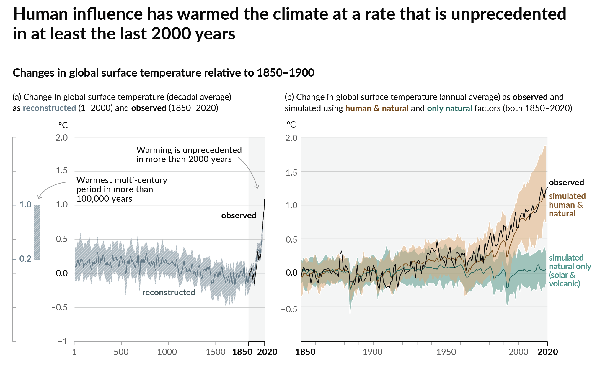
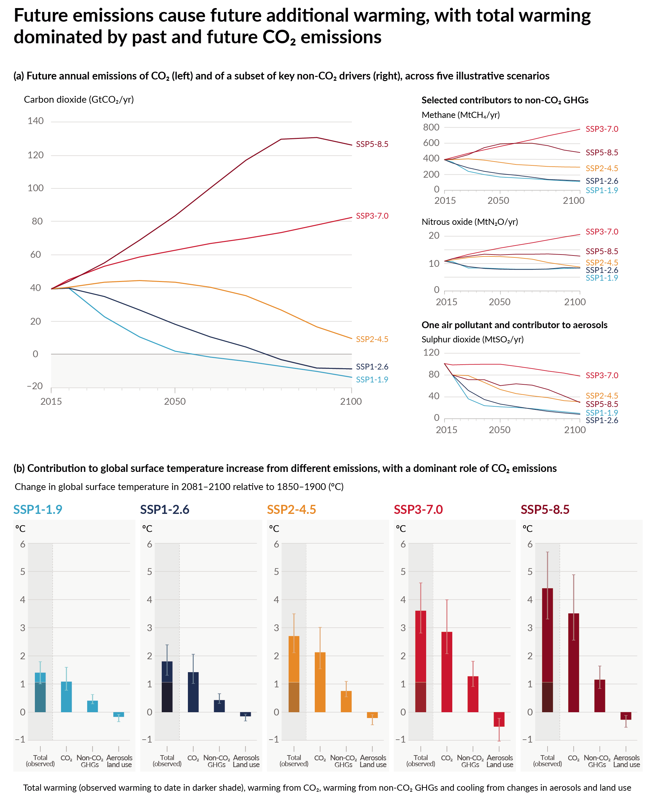

If you’re already plenty freaked out about the climate and don’t want an anxiety attack right now, skip the climate stuff.

# How do we know climate change is happening?

## How do we know the CO2 is from fossil fuels?

1. We know very accurately how much fossil fuel (FF) is burned each year thanks to market data, and we know how much CO2 is produced by burning it thanks to chemistry, and this amount accounts for the increase we see in global CO2 atmospheric concentration as measured for the last several decades (accounting for the amount absorbed by land/ocean sinks). 
2. Additionally, FFs have very old carbon (because they were made by dinosaurs etc.), so their Carbon-13 isotope concentrations are much less than “normal” carbon that’s been circulating since then. The amount of C-13 in the air now matches the profile from fossil fuel burning rather than all new and fresh air. 
3. Burning takes oxygen, and there has been a decrease in atmospheric oxygen that matches the amount that would be used to burn as much FF as we do. 

## Don’t plants like CO2 and warmth? Isn't some warming a good thing? 

Yes, plants do benefit from an increase in atmospheric CO2, and satellite data has shown that globally, plants are getting greener and leafier as CO2 goes up, but this effect will saturate eventually. The increased warmth is going to hit the tropics much harder than mid-latitudes and make it too hot for plants. THis will decrease their productivity, effectively canceling out increased productivity from the extra CO2. Far northern and southern climates are also getting warmer and benefiting from the CO2 and increasing the growing season, but this isn’t necessarily good – as you decrease snow cover, the surface of the earth gets darker (dirt and trees are darker than snow and ice). Thus, less incoming sun energy is reflected, leading to an increase in temperature overall (some studies suggest that afforestation at high latitudes is on the whole worse for global temperatures because the decrease in reflectance --  fancy name surface albedo -- is worse than the carbon uptake from those trees). 

## How much CO2 is there actually out there right now? 

Currently, about 420 ppm, higher than anytime in the last 2 million years (pre-industrial average was about 280 ppm). Global temperature has increased about 1.2C (2.2F) on average, faster than anytime in the last 2000 years

{:.imagecaption}
_Temperatures are far higher than any temperatures in history (1)._
	 
## What if we turned off all of the fossil fuels right now this instant? 
The earth will continue to warm because of the feedback cycles already set in motion – it will take thousands of years to reach equilibrium, which is largely dominated by the ocean slowly absorbing heat and glaciers/sea ice melting. These changes are irreversible (e.g. can’t re-freeze the glaciers even if we lower temperature). The exact amount of warming we would reach is somewhat hard to model due to lots of feedbacks in the climate system. For example: 
* If it’s hotter, the air can hold more water vapor, which acts as the strongest greenhouse gas, which then increases the temperature more. 
* If there’s more water vapor, then we get more clouds. Clouds both reflect sunlight (cooling) and also act as a blanket keeping more heat on earth. This mixed effect is the main uncertainty driver in long term climate modeling.
* If it’s hotter, there’s less ice, which then reflects less sunlight, which increases the temperature more. 

## What if we reach net zero by 2050 like people are saying we should/will? 
That corresponds to the SSP1-1.9 scenario as laid out in these graphs (also from IPCC AR6) – if we reach net zero by 2050 and then continue to go negative for years after that to reduce the total carbon concentration, we could limit to ~1.5C (2.7 F), which has been declared internationally to be the "safe" amount of warming. Other scenarios are laid out below. 

{:.imagecaption}
_Dramatic reductions in emissions and sustained negative emissions are needed to limit warming to 1.5C (2.7F) (2)._

# Products vs. Services

Shifting what companies sell from products to services is generally more sustainable. For example: Instead of selling an airplane engine, Rolls Royce sells “engine flying hours.” This solves a whole bunch of circular economy incentive problems
1. The product model promotes planned obsolescence (intentionally designing products to be obsolete after a certain period of time): Rolls Royce only gets more money when the engine breaks and you have to come to them for repairs or buy another one entirely.
2. The service model promotes better engineering: if Rolls Royce is getting paid by the flight hour, their incentive is to make a more reliable engine that needs fewer repairs and can last longer to make them more money. 
3. The service model also helps solve the end of life problem – Rolls Royce retains ownership of their engine, so when it does come to the end of life they have the responsibility and incentive to come and get it and extract parts from it for reuse/recycle/remanufacture and resale (vs. if they did not have ownership they have to hope that the customer sells it back to them and doesn’t send it to the junkyard).

## Design for Disassembly

There are lots of sustainable design principles, but this one has the most specific rules that I had never thought about before. Designing for disassembly aims to make it easier to take apart and remanufacture or recycle products at end of life. Here are a few of the notable rules:
* Consolidate parts and use a minimal number of materials. 
* Don’t use fasteners that can’t be opened and closed multiple times (eg nails, glue, welding), and if you must use tools to open the fastener, make it the same tool.
* Build in the instructions for disassembly, and label materials with their recycling number. 
* Put fasteners on the same side and plane of an object. 
* Make things that you don’t want shredded (toxic or valuable materials) in the recycling process easy to find.
* Don’t use paint or composite materials – it ruins the recyclability. 

## Soup Protest
You may have heard about the tomato soup that was thrown on a Van Gogh, and I liked this [opinion piece](https://inews.co.uk/opinion/ust-stop-oil-van-gogh-soup-stunt-misunderstood-protest-1916517) on it. There is no art on a dead planet.

## References 
1. Figure SPM.1 in IPCC, 2021: Summary for Policymakers. In: Climate Change 2021: The Physical Science Basis. Contribution of Working Group I to the Sixth Assessment Report of the Intergovernmental Panel on Climate Change [Masson-Delmotte, V., P. Zhai, A. Pirani, S.L. Connors, C. Péan, S. Berger, N. Caud, Y. Chen, L. Goldfarb, M.I. Gomis, M. Huang, K. Leitzell, E. Lonnoy, J.B.R. Matthews, T.K. Maycock, T. Waterfield, O. Yelekçi, R. Yu, and B. Zhou (eds.)]. Cambridge University Press, Cambridge, UK and New York, NY,USA, pp. 3−32, doi: 10.1017/9781009157896.001
2. Figure SPM.4 in IPCC, 2021: Summary for Policymakers as above. 

