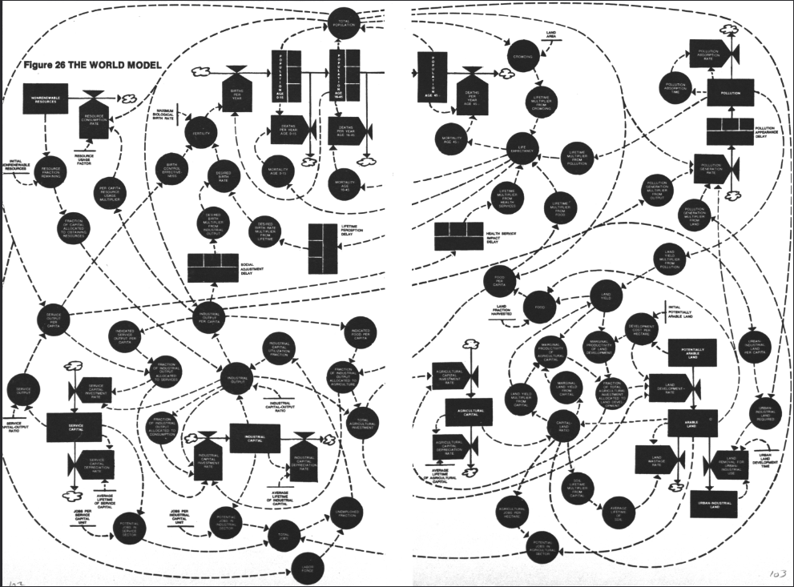
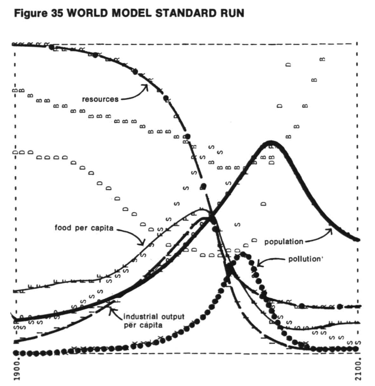
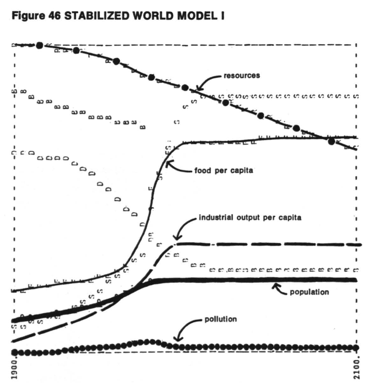
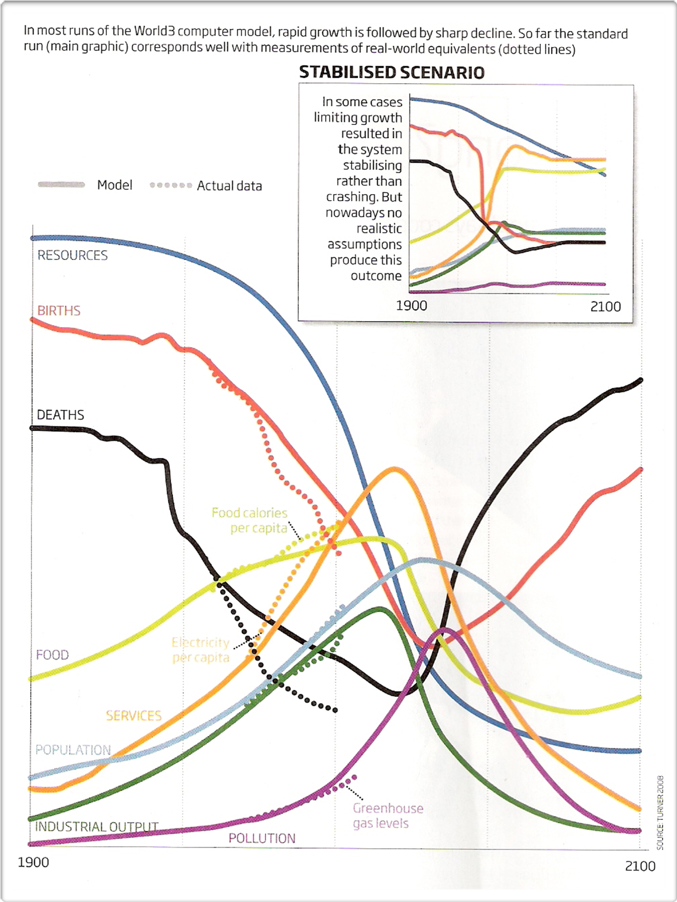

_[Limits to Growth](https://www.donellameadows.org/wp-content/userfiles/Limits-to-Growth-digital-scan-version.pdf)_ is a book/study published 50 years ago (1972) by a group from MIT. They used system dynamics to create a model (obligatory “all models are wrong and most are useless” caveat) of the entire world, abstracted to include stocks like population, industrial capital, pollution, cultivated land, and flows like births, deaths, investment, depreciation, land erosion, pollution generation, and land development. 

{:.imagecaption}
_The World model - image from_ Limits to Growth _(p 103)._

The functional relationships between these flows and stocks were fit based on historical data, creating feedback loops. The group then ran 12 scenarios to the year 2100 by tweaking different relationships based on potential policy decisions. Based on a business as usual scenario, they predicted that population would collapse right about now (2020-2030) because the pressures of an exponentially growing population in a world with finite resources would simply deplete our resources too quickly, causing a huge slowdown in industrial output and food production which then kills us all off.

{:.imagecaption}
_The business as usual model results - image from_ Limits to Growth _(p 124)._

This got a lot of people very upset. The book also includes these unhappy scenarios, which build on each other:
* World with 2x initial natural resources --> still overshoot and collapse, just slightly later
* World with unlimited energy and better recycling to created unlimited natural resources --> overshoot and collapse caused by pollution
* World with unlimited energy and resources and technology to control pollution --> overshoot and collapse due to running out of land to grow food 
* World with unlimited resources, pollution control, and increased agricultural yields --> overshoot and collapse due to pollution control not being able to keep up with the industrial output for an exponentially growing population
* World with unlimited resources, pollution control, increased yields, and voluntary birth control --> Still eventually collapses due to eventual resource depletion

Essentially, the problem is exponential growth in a finite world. After trying a series of policies and technologies on the model, they find a scenario that stabilizes with the following policies applied: resource recycling, pollution control, methods to restore depleted land, decreased emphasis on industrial production and increased emphasis on food and services, available birth control that stabilizes the population, and limiting capital investment to capital depreciation (industry is stabilized rather than growing):

{:.imagecaption}
_The model results with stabilizing policies - image from_ Limits to Growth _(p 165)._

This also got a lot of people very upset, as it indicates that they only way for us to not all kill ourselves is to accept the physical limitations of Earth. The magical combination that results in a stabilized world is:
1.	A stable population
2.	A sufficiency material lifestyle 
3.	Controlling pollution and conserving natural resources
4.	Increasing agricultural yield 

(The authors note that a sustainable society does not mean zero economic growth. The economy and money are made up, so if you can decouple economic growth from physical resource use, then you could keep growing the economy.)

So, how does this 50 year old model compare to what’s actually happened in the world since then? The graph below shows how the standard model with no policy changes corresponds pretty well with what’s happened in the last 50 years. Though we haven’t hit the predicted collapse, it doesn't look amazing so far. 

{:.imagecaption}
_The original model compared with observational data - image from [this New Scientist article](https://www.newscientist.com/article/mg21328462-100-boom-and-doom-revisiting-prophecies-of-collapse/) based on a study by [Turner 2008](https://doi.org/10.1016/j.gloenvcha.2008.05.001)._

Though the model does not include everything (e.g., wars and pandemics), and some would critique that the model underestimates technical innovation and individual agency, the authors give some lessons learned from the model (see their 30 year [update paper](https://donellameadows.org/archives/a-synopsis-limits-to-growth-the-30-year-update/) and 50 year [update video](https://www.youtube.com/watch?v=ykFXvUDnw9Y)). They say that we can still turn the ship if we:
* Extend our planning horizon – think over the long term
* Improve our response time to the signals we are getting – react faster to the information we are getting from climate scientists and experts
* Minimize our non-renewable resource use - stop using fossil fuels
* Prevent the degradation of renewable resources - stop degrading nature
* Use resources efficiently - shift to a circular economy
* Slow and stop the exponential growth of population and physical capital - shift away from a material culture and ensure access to education and healthcare for all

Funnily enough, several of those requirements resonate with the ideas in Vogel et al (2021) discussed in [this post](https://ml-henderson.github.io/term1_week1_2) about how there are ways to run our society so that everyone can have a decent standard of living while staying within our planet's resources.
