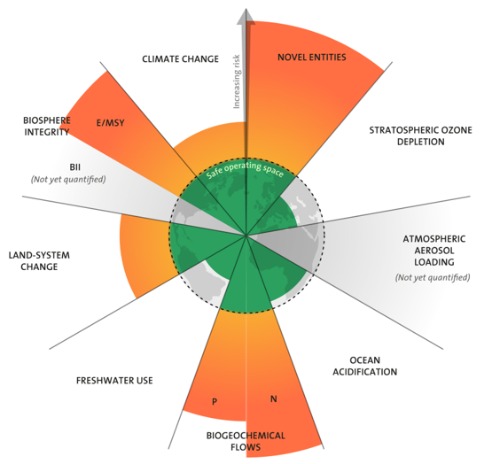
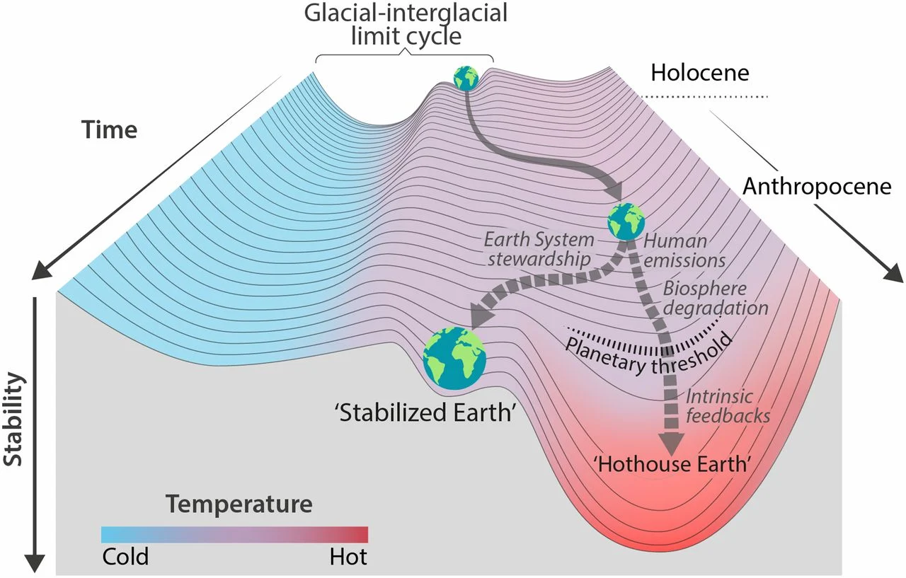
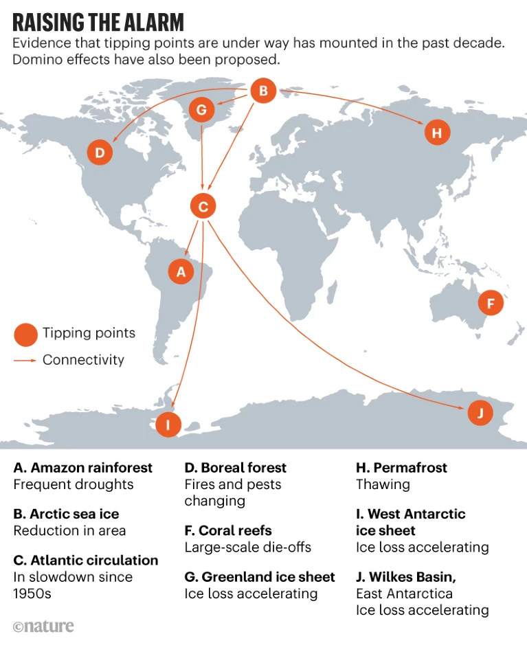
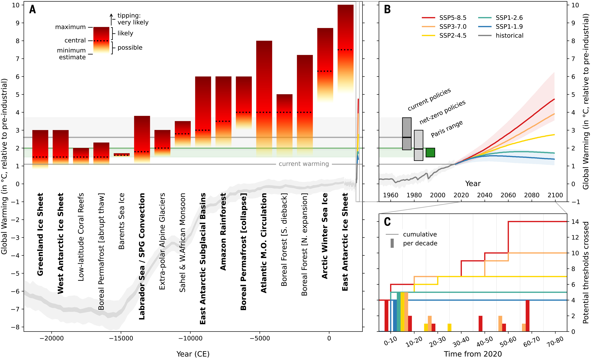

This week is pretty depressing. You may cry a bit.

# Planetary Boundaries 
“Climate change” as a term has come to be all-encompassing for environmental degradation, rather than just the problem of carbon in the atmosphere. Carbon is also the problem we have tended to focus most on as a society, e.g. all the recent net zero pledges around greenhouse gas emissions. But, turns out there 8 other planetary boundaries we need to worry about, some of which are already in a more dire condition than global temperature. 

You might have heard of the global ice ages that happened repeatedly in the last several million years. What’s wacky is that in the last 10,000 years or so, we have been in an extreme stable climate period (called the Holocene) that has allowed us to develop civilization without being killed off by a too hot or too cold earth. [Steffan et al (2015)](https://doi.org/10.1126/science.1259855) basically quantified what the “safe zone” is for the bio-geo-physical processes that keep us in this stable state. We are now changing our environment so much that we are pushing 5-6 of these processes out of the safe zone (so much so that we are in a new geological era – the Anthropocene). 

The boundaries are: 
1.	Biosphere integrity (biodiversity): Ecosystems depend on organisms to keep them stable (see Gaia Theory in future post). We are currently driving 100-1000x more species to extinction than the natural rate of extinction, mainly due to habitat loss. 
2.	Climate change: we know this one. 
3.	Biochemical flows 
    a.	Nitrogen: Thanks to the Haber-Bosch process, we take inert nitrogen from the air (N2) and make fertilizer with it. Plants love N, and it makes them grow faster, and this is a huge part of the Green Revolution that allowed us to increase agricultural yields and feed (most of) the world beyond previous expectations. However, we are then increasing the total amount of N in the natural cycles, and most of it is turning soils acidic, washing into water and causing algal blooms that kill all the other things (eutrophication), and turning into N2O which is another greenhouse gas! 
    b.	Phosphorus: We also use this for fertilizer, but we mine it from the ground. It also washes into water and algae takes up all the oxygen and kills everything (eutrophication). 
4.	Stratospheric ozone depletion: This is back in the green thanks to the banning of CFCs! It protects us from UV radiation.
5.	Ocean acidification: The ocean is a huge sink (up-taker) of CO2, but increasing the CO2 in the ocean means that it is getting more acidic. This kills corals and shellfish by reducing the carbonate available for their shells and ripples through the ecosystem. 
6.	Global freshwater use: There’s only so much freshwater to go around. I need not explain this to the West Coasters – different areas of the world are struggling more or less with this boundary, but on average it isn’t in danger yet. If we use too much, that will also obviously be bad. 
7.	Change in land use: Deforesting land (or draining wetlands, or ploughing prairies) and converting it to farm fields, cities, or suburban parking lots has both a carbon cost and a biodiversity cost. Destroying an ecosystem means all the carbon that had been stored in it is released as the plants and animals die and microbes die. It also means there less habitat to preserve biodiversity. This will also cause shifts in rainfall and other weather patterns if there are less plants to help cycle water back to the atmosphere.
8.	Atmospheric aerosol loading: No definitive boundary has been set for this yet. Atmospheric aerosols are basically air pollution – they can cause acid rain, asthma, cardiovascular disease, and other health problems. They also can cause clouds to form, changing rainfall patterns. They also can potentially be used for solar radiation management (geoengineering). We don’t know how much is too much exactly, since some naturally occurs thanks to volcanoes.
9.	Novel entities: This means pollution we don’t even know is bad yet. There are new chemicals being invented every year, and microplastics have permeated all parts of the earth and our bodies, but we aren’t sure what the effects are or what the limit is. 

So you can get a summary of where things are from the graph below: 

_The state of the PBs as of 2022([Persson et al 2022](https://doi.org/10.1021/acs.est.1c04158))_

# Tipping Points
As if all that wasn’t enough, we have to remember that the earth is a complex and non-linear system, filled with reinforcing and stabilizing feedbacks. It is quite stable within a wide range of parameters, but as we push the envelope, killing species and changing the flow of chemicals and energy, we are removing the damping feedbacks that kept us in the nice Holocene environment. As we push the envelope on certain parameters, earth system modelling indicates that at a certain point, a small push over the edge (the tipping point) could lead to a huge cascade of self-perpetuating catastrophic changes. (For a refresher on tipping points, a recent example was Covid - enough people now have immunity to prevent a mass outbreak, but as herd immunity weakens (weakening the stabilizing feedback), we could reach a tipping point where the disease once again begins to spread, entering a state of runaway amplifying feedback.) 

This means that how bad things are is not going to scale linearly which how hot it gets. More of horrible disasters are happening now (fires, floods, heat waves, hurricanes, etc), and we are at +1.2C (2.2F). You might think that +1.5C (2.7F), or even +2C (3.6F), is not *that* far away from where we are now, but if we hit any of the tipping points of some of the major climate features that keep the world nice, things could get very bad very fast. This has happened several times in the history of the earth, and there’s usually a mass extinction, before the earth settles into a new stable state. The even better news is that these changes are usually irreversible (at least on the human timescale). 

_An illustration of the climate tipping point ([Steffan et al 2018](https://doi.org/10.1073/pnas.1810141115))_

Here’s a few of the top climate tipping points scientists are worried about: 

1.	If the Arctic starts melting (less ice --> darker water --> absorbs more sunlight --> more melting), then,
2.	The water in the North Atlantic will get less salty and less dense, so the cold dense water will not sink, which decreases the convection that drives the Atlantic Meridional Overturning Circulation current which circulates the warm and cold water in the Atlantic ocean and drags rain systems north, so without it, 
    a.	The West African Monsoon will be destabilized and cause a drought in the Sahel, and also
    b.	There would be droughts in western Europe, and also
    c.	The Amazon will get drier, which would 
3.	Disrupt the East Asian monsoon, which would 
4.	Heat the Southern Ocean, which would 
5.	Melt the Antarctic, further increasing sea levels,
And so on. 

_Image from Climate tipping points – too risky to bet against [(Lenton et al 2019)](https://www.nature.com/articles/d41586-019-03595-0) (if you only read one article it should be this one as it’s quite understandable)._

How close are we to these tipping points? Climate is very hard to model, but we are in the zone already of tipping for some key systems. The Amazon forest could tip to a mass die-off at 20-40% deforestation, and we are at 17% now. The melt in the Greenland ice sheet is accelerating. Most things get pretty serious beyond 1.5C of warming. 99% of all coral will die if we get to 2C. 

_Image from Exceeding 1.5C of global warming could trigger multiple climate tipping points [(McKay et al 2022)](https://doi.org/10.1126/science.abn7950)._

You can grieve for all the loss that’s already happened, and the loss and suffering that is inevitably going to happen. I read an article this week that summed it up – the worst thing about climate is the realization that all we do will never be enough because we’ve already done so much damage. But all is not lost. To paraphrase one of my favs Dr. Ayana Elizabeth Johnson - every ounce of carbon we keep out of the atmosphere, every bit of plastic we keep out of the ocean, it all matters. The rate of melting can still be slowed. We still have time. This post was not meant to send you into a doomerism spiral,  just to communicate the urgency that I don’t think is often communicated. 
