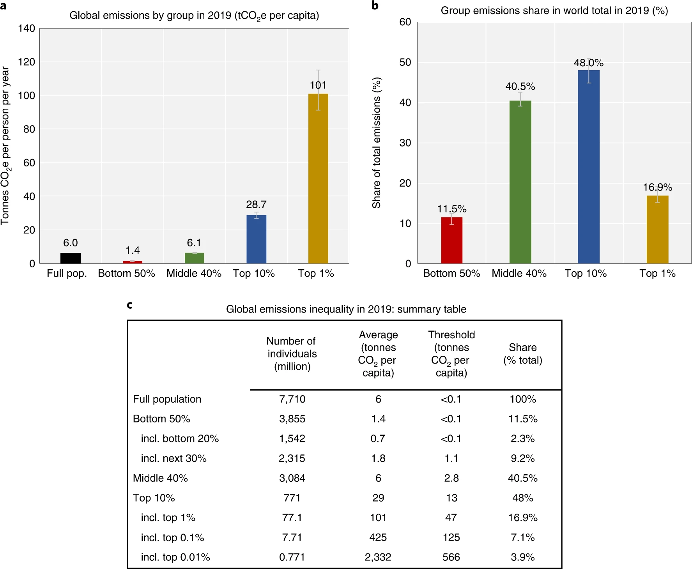

I’m going to spend this week on a potential climate new year’s resolution (if you are looking for a basic overview of climate resolutions, this [Life Kit](https://open.spotify.com/episode/0hZfa8SABvhuJSgahJLQfC?si=89c4c8a213424b92) podcast is a nice 10-min listen (spoiler: top suggestion is reducing your food waste).

The issue of a personal climate resolution can feel thorny. On the one hand, the majority of emissions are caused by corporations and governments. Your personal footprint is tiny in comparison. Carbon footprint calculators and shifting the blame to personal responsibility have been a tool to deflect responsibility from the petrochemical/fossil fuel industry for decades. By putting the onus on us to try and recycle, turn out the lights, and turn off the water while your brush your teeth, they have been effectively distracting us from the real problem (them). Engaging with the ‘personal responsbility’ argument by trying to live a lower-emissions lifestyle (and all the extra time, effort, and guilt involved) instead of focusing on creating systemic change can feel naïve and pointless. (read _The New Climate War_ by Michael Mann or listen to this [Throughline](https://open.spotify.com/episode/2DPUWG4bcGFCpJWfUmI6xu?si=d1061f639b87494e&nd=1) episode on how corporations made us think litter is our fault).

On the other hand, I think we do actually have a personal responsibility in this. I think some guilt is warranted. We have a responsbility as the top 1% or so of income globally (>50k/yr/person USD according to the World Bank; top 10% is > 15k/yr/person USD). We are the ones that are emitting the most based on our lifestyles (the below graph of average emissions by income is pulled really high by the 0.1% - the average American emits about 15 metric tons/yr). Our lifestyles are the ones that need to change (along with the systemic changes to energy system, transportation, etc). A simple rule of thumb is the more money you spend, the higher your carbon footprint is. Everything you buy, everywhere you travel, the size of the house you live in --  all the ‘luxury spending’ that grows as your income grows -  is adding to that footprint. 

I’m not saying give away all your possessions and live a life of simplicity (fun religious crossover there). But I do think that we have a responsibility to think very carefully about how we spend our money. What I am trying to do is a lite version of a Buy Nothing year: I’m not buying things for fun. I’m trying to get things that I need secondhand (hello Ebay or facebook) or borrowing them. I’m going to obviously replace the shampoo I have when it runs out, but not upgrade it. If I can’t find it secondhand, I am going to buy a good quality item that I will keep for a long time and be able to repair. 

I also realize that thinking about this takes up a lot of brainspace and sometimes extra money. And I’m sorry if I have now cast the curse of consciousness on you that will haunt your every purchase. You don’t have to be perfect – society/consumerism are not super conducive to that. But we can all be a little bit better this year. 

{:.imagecaption}
_I know I’ve already shared this graph at least once but it just hits so hard [(Chancel 2022)](https://doi.org/10.1038/s41893-022-00955-z)_ 

Let me know if you have tips for how to retrain your brain to want things less!

