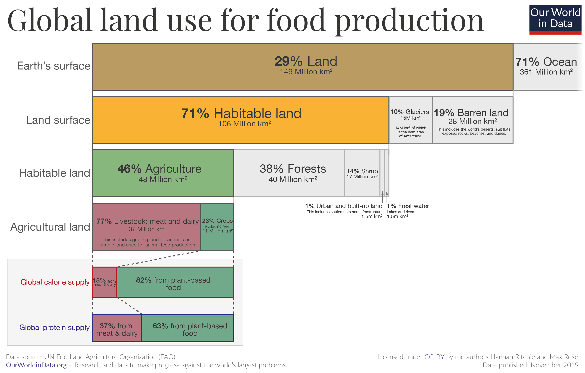

I present a policy proposal to help reduce livestock consumption and production in the UK (below). The introduction where I scream about how bad meat is for the environment is woefully short due to the word count limitations. I’m going to expand on that for yall here because I haven’t done a Please Stop Eating So Much Meat episode yet. The existing veggies can skip ahead. 

## 1.Livestock use SO MUCH of our land 
Turning land that can’t grow crops into calories for people via animals eating grass isn’t inherently a bad thing, and animals can play an important part in nutrient recycling on a farm when incorporated into a rotational system. However, the way we raise livestock is much more intensive than that – we feed them grain that is grown on crop land that either a. could be used for feeding people or b. used to be natural land like rainforest. This in itself wouldn’t be so bad if it didn’t take disproportionately way more land to make 1000 calories of meat than 1000 calories of plants – animals return only about 10% of the calories we put into them in food for us. This chart below shows how 77% of the global agricultural land is used for livestock which only produces about 18% of the global calorie supply and 37% of the global protein supply. With many competing priorities for land use (farming, preserving a small piece of the natural world, urban development, replanting trees for carbon sequestration, etc.) this doesn’t seem like the most optimal solution. 

{:.imagecaption}
_Image from [Our World In Data](https://ourworldindata.org/environmental-impacts-of-food?insight=half-of-habitable-land-is-used-for-agriculture#key-insights-on-the-environmental-impacts-of-food)_

## 2. Health concerns
Besides eating red meat being literally carcinogenic, raising livestock has huge impacts on our health. Livestock are given preventative antibiotics, contributing to antibiotic resistance which is one day going to severely bite us in the a**. Livestock farming creates a bunch of airborn particles which exacerbate respiratory disease. It also damages the environment way more than crop farming, which then has an impact on human health through climate change and water pollution. If you haven’t seen these graphs on impact before, take a look: 

<iframe src="https://ourworldindata.org/explorers/food-footprints?facet=none&hideControls=true&Commodity+or+Specific+Food+Product=Commodity&Environmental+Impact=Carbon+footprint&Kilogram+%2F+Protein+%2F+Calories=Per+kilogram&By+stage+of+supply+chain=false&country=Bananas~Beef+%28beef+herd%29~Beef+%28dairy+herd%29~Cheese~Eggs~Lamb+%26+Mutton~Milk~Maize~Nuts~Pig+Meat~Peas~Potatoes~Poultry+Meat~Rice~Tomatoes~Wheat+%26+Rye~Tofu+%28soybeans%29~Prawns+%28farmed%29" loading="lazy" style="width: 100%; height: 600px; border: 0px none;"></iframe>

## 3. But my beef is local! 
That doesn’t excuse it. Food miles are one of the smallest contributions to the emissions from eating meat. What you eat is a much bigger factor. 

{:.imagecaption}
 _Image from [Our World In Data](https://ourworldindata.org/food-choice-vs-eating-local)_

## 4. But what about the protein?!?!?!
People in the US and Europe are on average consuming way more than the recommended/necessary amount of protein every day (well over 60 g/day vs recommended ~50g/day), including vegetarians and vegans [(Mariotti and Gardner 2019)](https://www.ncbi.nlm.nih.gov/pmc/articles/PMC6893534/). You can more than satisfy protein requirements from plant sources. 

## 5. But I LOVE how meat tastes!!!
Please go try an Impossible Sausage and an oat latte. Also, reducing your meat doesn’t mean you can never have a steak again! Even reducing your meat/dairy by 1/3 or 1/2 has a huge impact.

## 6. But what about feeding cows seaweed to reduce their methane emissions or other technical fixes?
That’s pretty much equivalent to us relying on carbon capture and storage (see [this post](https://ml-henderson.github.io/term1_week4)) instead of stopping our use of fossil fuels.

# Policy Proposal for the UK
A reduction in livestock production and consumption is critical for the sustainability transition in the UK, but there are no explicit policies towards this goal. Current policies provide some support towards a diet and farming shift but do not have specific measures to capitalize on current trends of reducing animal product consumption. Three recommended policies will utilize leverage points to create a positive tipping point away from animal consumption and production:
* Public procurement of plant-based foods to increase demand and shift social norms.
* New agricultural subsidies for conversion away from livestock farming to build on current nature restoration schemes.
* A gradually increasing animal product consumption tax to create cost-parity with plant-based alternatives and unsustainable animal products. 

<embed src="https://ml-henderson.github.io/assets/files/Livestock_policy_proposal.pdf"
    type="application/pdf" 
    width="100%"
    height="600"/>

<!-- [PolicyBrief.pdf](../assets/files/Livestock_policy_proposal.pdf) -->

