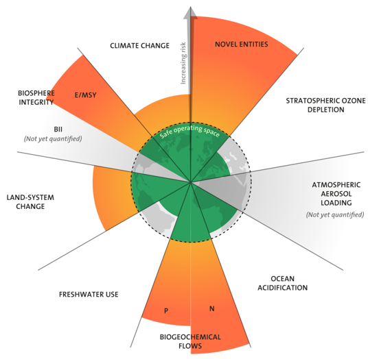

Remember the planetary boundaries and this category called “Novel Entities” which basically is all the new chemicals and substances we are making and leaking into the environment with no real clue what’s going to happen to them? 

_The state of the PBs as of 2022([Persson et al 2022](https://doi.org/10.1021/acs.est.1c04158))_

I just listened to this Radiolab [podcast](https://open.spotify.com/episode/1KLqMvJKgpCicfcBa8oNMo?si=634ddf18e3064f43) about how all the vultures in South Asia started mysteriously dropping dead in the early 2000s. Vultures play a really important role in ecosystems by being a garbage collector/immune system – they eat all this dead stuff with bacteria, fungi, and viruses growing in it (potentially from animals killed by disease). Their stomachs have evolved to be extremely acidic and kill all those microorganisms, allowing them to not get sick and carry on (haha carri-on) eating all the dead animals around, stopping disease spread. They play such an important role that vultures have evolved separately 4 times on 4 different continents (crazy!). In the early 2000s, they started dying suddenly and mysteriously in India, then Nepal, then Pakistan. Bird scientists could not figure it out – it wasn’t a disease or starvation or a known toxin or anything. Finally, they realize that it’s kidney failure. But why are all these vultures getting kidney failure? They determine it’s from this NSAID that’s basically ibuprofen for cows. Cows in India get treated much nicer than the west, and they die of natural causes and get eaten by vultures rather than being burgers. So all these cows that are getting painkillers are eventually getting eaten by vultures, which overdoses the vultures on this NSAID which gives them kidney failure and they die. The same thing can happen in humans with NSAIDs if you’re old and taking quite a lot of them. So the podcast ends with this doctor being like “no one panic, NSAIDs are fine to take for humans, this was just like a weird crazy coincidence, keep popping your Advil” - which really isn’t the whole story. 

We excrete some amount of all the drugs we take, unmetabolized, and sewage systems do not filter them out. Pharmaceutical pollution has been found [pretty much globally](https://www.theguardian.com/environment/2022/feb/14/drugs-have-dangerously-polluted-the-worlds-rivers-scientists-warn) – everything from caffeine to hormones from birth control to antidepressants to antibiotics to diabetes drugs. If you’re a fish swimming in a river, you’re getting exposed to some mixture of these all the time and absorbing them, which ripples through the ecosystem. The effects are only beginning to be understood – everything from intersex frogs (cue Alex Jones except it is legit) and falling fish populations from birth control to birds feeding less from antidepressants. That’s not even touching on the antibiotics in the environment causing antibiotic resistance, or the chemicals leaching from plastics, pesticides, and herbicides. We are busy making life-improving drugs and materials, and they have great results for humans. But there’s really not much consideration of what happens when they inevitably end up in the environment, and eventually come back to bite us in the form of superbugs, collapsing ecosystems, or contaminated food. The vulture incident was dramatic enough for people to notice and do something about it, but weird things are happening all around us all the time that we probably aren’t noticing. 

Obviously, don’t stop taking Tylenol when you need it or whatever other medications are allowing you to live a happy and healthy life. But that’s not free. And as a society we have to think just a little bit beyond ourselves and what happens to the stuff we use once it’s out of our sight and acting as a novel entity in the world, as well as how we prioritize our quality of life over every other organisms’. 