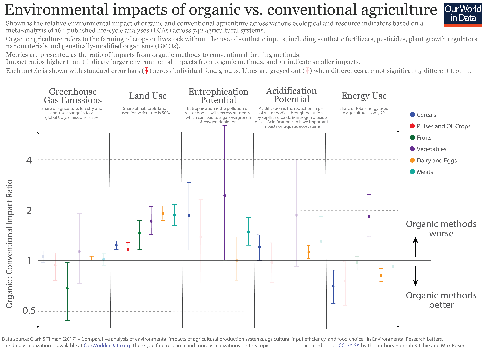
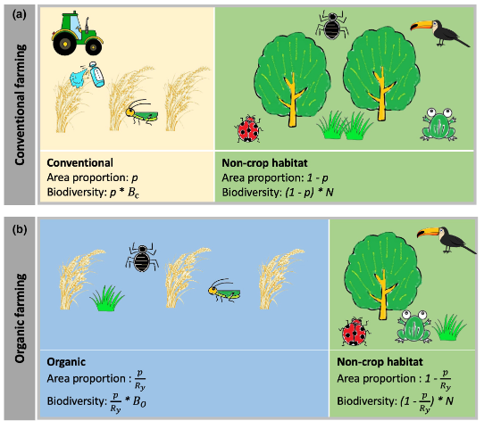
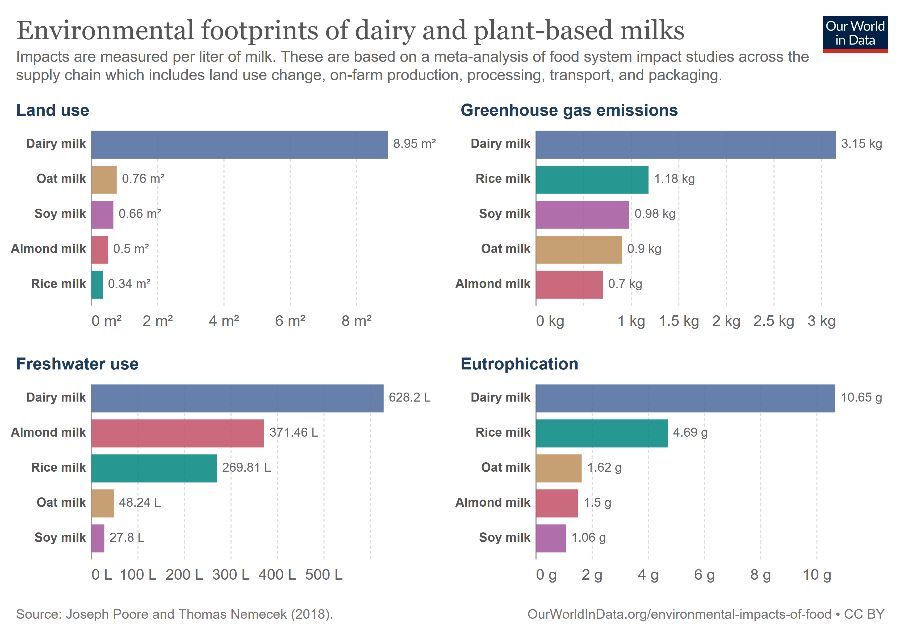

## Carbon Footprinting
For the last three weeks ish I’ve been doing an unpaid (gasp coming from engineering world) internship as a sustainability consultant for a local plantmilk company. The plantmilk is delicious (this is also an unpaid advertisement for them). I did a little carbon footprinting for them about their products. I’ve attached the non-confidential overview here because I love it. 
 
Carbon footprinting, it turns out, is all engineering estimation. I basically made a big spreadsheet and approximations about what types of trucks the oats travelled on, and rationalized assumptions like how the packaging weight is negligible because it’s bulk ordered and waste is accounted for separately, and how I don’t need to worry about the distributor cold storage refrigerant emissions because the percentage of ReRooted product they’re carrying compared to their own product is very very small, and finding industry averages for things I couldn’t measure. And then I plugged in emissions factors from databases. It felt very much like the longevity modelling work I did at Medtronic. 
 
I should note that carbon emissions are only one aspect of environmental impact on our planetary boundaries, but as that’s the thing everyone is focusing on, there’s more data available on the carbon equivalents of various activities (vs. the eutrophication potential or biodiversity impact etc) without having to get into expensive software (if this blog was a bingo card the free space would be “mentions planetary boundaries”). 
 
I’m going to c+p directly from the more detailed report I have given them for these two sections below about the impact of organic farming on emissions as well as the plantmilk vs. dairy discussion because those are very non-confidential and I learned something. 
 
## How does organic farming affect environmental impact? 
One limitation of this study is that footprint estimates for organic rather than conventional ingredients were not available. However, based on the meta-analysis by Clark and Tilman (2017) of lifecycle assessments of hundreds of agricultural systems, there is not a large overall difference in the GHG emissions of organic vs. conventional agriculture; however, they do generally differ on other impact categories. Because organic farming does not use many (if any) synthetic inputs to increase intensity and yield, organic farming uses more land per unit of food than conventional. Organic also tends to cause more eutrophication and acidification because of the fertilization method. Manure applied as fertilizer releases its nutrients (mainly nitrogen) as determined by the environment and timing of application, rather than by the needs of the plants as is the case with synthetic fertilizers. This can lead to a mismatch in timing between the needs of the crop vs the nutrient availability, which can lead to more runoff of nutrients to the environment. On the other hand, because of the lack of synthetically manufactured fertilizers, pesticides, and herbicides, organic farming usually uses less energy overall than conventional. The GHG emissions between the manufacture of synthetic fertilizer vs. the emissions from the application of manure (using manure can lead to more emissions of nitrous oxide which is a GHG) tend to balance out. Results may differ on a farm-by-farm basis (14). Thus, the use of conventionally farmed ingredient data (or the choice of ReRooted to use organic ingredients) does not have a large effect on ReRooted’s GHG emissions, but the impacts in other areas are affected (see Figure 5). 

_Figure 5: Organic vs. conventional farming impacts in five environmental categories (14), (15). Data is presented as a ratio of impacts; ratios higher than 1 indicate that organic has a higher impact than conventional. Error bars shown. Bars greyed out for results not significantly different than 1 (equivalent impact)._

An important impact category that is not often included in lifecycle assessments due to the lack of standardized measurement is biodiversity. Conventional vs. organic agriculture has an effect here as well, though it is still not a black and white comparison. Organic farms definitively share the land with more biodiversity (on average 1/3 more), especially for cereal crops, but this varies by environment and species (16). However, the decreased yield on organic farms means that more land must be used for farming the same amount of food than conventional farms, decreasing the land that can be spared in its natural state, which supports more biodiversity than either farming method (Figure 6). Gong et al. (2022) did a meta-analysis of agriculture biodiversity to provide an answer to this land-sparing vs. land-sharing debate. They found that the biodiversity gain of an organic farm is almost equivalent to the resulting yield loss, and organic farming supports more overall biodiversity than conventional (land-sharing) when the natural lands are less than 2.4 times as biodiverse than conventional farms (e.g., deforesting more of the Amazon rainforest for organic farming is not a good trade-off, but organic farming in the UK, one of the least biodiverse nations, is probably beneficial). This is also highly dependent on environmental conditions and ecosystems (17). Thus, ReRooted’s organic supply chain, which is mostly based in UK/Europe with the exception of cashews from India, dates from Tunisia, and coconuts from the Philippines, is likely overall benefiting biodiversity. 

_Figure 6: Land-sparing (conventional) vs. land-sharing (organic) visualization (17)_

## Plantmilk vs. Dairy
While the benefits of organic vs. conventional agriculture are mixed, the benefits of plantmilk instead of animal milk are clear and significant. Poore and Nemacek (2018) conducted a comprehensive meta-analysis of impacts of more than 38,000 farms globally and forty different agricultural products. Though there was high variability between different instances of each product, depending on the exact environment and practices on the farm, the difference between animal products and plant products was so stark that it clearly rose above any variability and uncertainty associated with any environmental impact analysis; that is, even the most sustainably produced dairy is still worse than the least sustainable plantmilk (12). This is due to the inherent inefficiency in using animals to convert plant energy into food energy, rather than directly using plants; animals return only about 24% of the calories fed to them as whole milk (18). Therefore, more land, energy, and water must be used to feed and raise an animal for milk production than growing crops for direct human consumption in plantmilk (Figure 7). ReRooted and its customers can be confident that despite debates between oat or coconut, glass or plastic packaging, organic or conventional, UHT or not, they are still making a better environmental choice than animal milk. 
 
 
_Figure 7: Environmental impacts of dairy milk vs. plantmilk (12), (13). Plantmilk outperforms dairy on every score._

<embed src="https://ml-henderson.github.io/assets/files/ReRooted_external_brief.pdf"
    type="application/pdf" 
    width="600"
    height="600"/>

12.  J. Poore and T. Nemecek, ‘Reducing food’s environmental impacts through producers and consumers’, Science, vol. 360, no. 6392, pp. 987–992, Jun. 2018, doi: 10.1126/SCIENCE.AAQ0216/SUPPL_FILE/AAQ0216_DATAS2.XLS.
13.  H. Ritchie, ‘Dairy vs. plant-based milk: what are the environmental impacts?’, Our World in Data, Jan. 19, 2022. https://ourworldindata.org/environmental-impact-milks (accessed Feb. 26, 2023).
14.  M. Clark and D. Tilman, ‘Comparative analysis of environmental impacts of agricultural production systems, agricultural input efficiency, and food choice’, Environmental Research Letters, vol. 12, no. 6, p. 064016, Jun. 2017, doi: 10.1088/1748-9326/AA6CD5.
15.  H. Ritchie, ‘Is organic really better for the environment than conventional agriculture?’, Our World In Data, Dec. 19, 2017. https://ourworldindata.org/is-organic-agriculture-better-for-the-environment (accessed Apr. 19, 2023).
16.  S. L. Tuck, C. Winqvist, F. Mota, J. Ahnström, L. A. Turnbull, and J. Bengtsson, ‘Land-use intensity and the effects of organic farming on biodiversity: a hierarchical meta-analysis’, Journal of Applied Ecology, vol. 51, no. 3, pp. 746–755, Jun. 2014, doi: 10.1111/1365-2664.12219.
17. S. Gong et al., ‘Biodiversity and yield trade-offs for organic farming’, Ecol Lett, vol. 25, no. 7, pp. 1699–1710, Jul. 2022, doi: 10.1111/ELE.14017.
18. P. Alexander, C. Brown, A. Arneth, J. Finnigan, and M. D. A. Rounsevell, ‘Human appropriation of land for food: The role of diet’, Global Environmental Change, vol. 41, pp. 88–98, Nov. 2016, doi: 10.1016/J.GLOENVCHA.2016.09.005.
