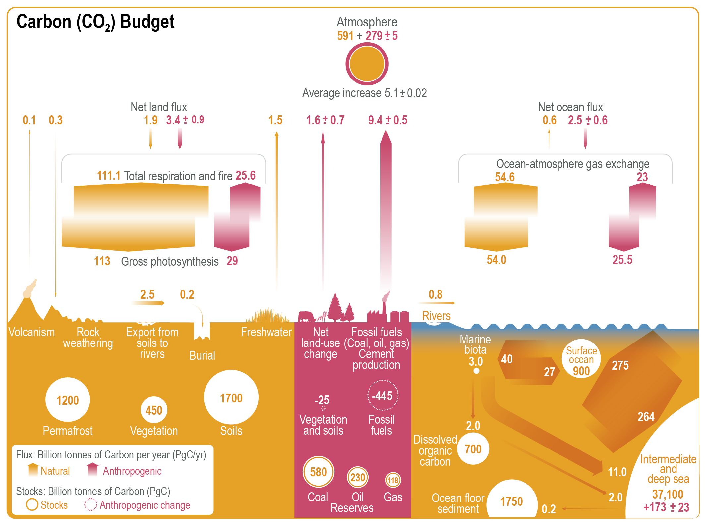
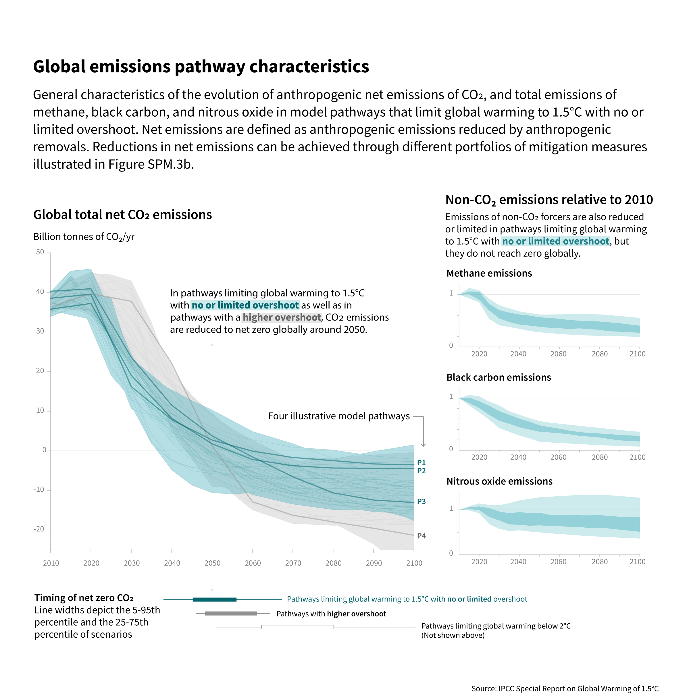
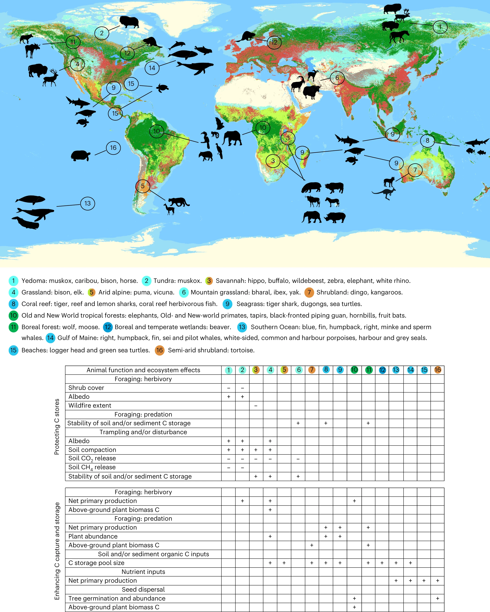
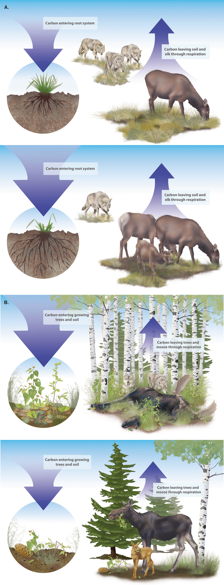

Stumbled upon this article in Nature last month and it was so interesting and cool and today I finally had time and will to write about it. 

_Trophic Rewilding can expand natural climate solutions_ [(Schmitz et al 2023)](https://www.nature.com/articles/s41558-023-01631-6)

We've talked before about the global flows of carbon: Humans are emitting 10-11 GtC/yr (billion metric tonnes of carbon), or about 40 GtCO2/yr (billion tonnes carbon dioxide which has a different molecular weight than just carbon hence the different numbers). Right now, about half of that is captured and store by the natural environment, mostly the ocean. 

_[(IPCC AR6 Chapter 5 )](https://www.ipcc.ch/report/ar6/wg1/chapter/chapter-5/)_

To have a chance of remaining with the "safe" (least bad) levels of warming (+1.5C, +2.7F), we have to go beyond net zero and have many years of negative emissions - not only emitting zero carbon but also taking it out and storing it - for many many years because the levels of CO2 in the atmosphere are already so high. If all that CO2 stayed in the atmosphere, the planet would continue to warm until reaching equilibrium many many years in the future. 

_(IPCC Special 1.5 Report [Summary for Policymakers](https://www.ipcc.ch/sr15/))_

We've also discussed out man-made carbon capture and storage solutions are largely BS. Nature-based solutions are the only real large scale credible solutions. This is where you hear a lot about planting billions of trees etc. 

However, something we largely see as separate from this is the issue of conserving wildlife species. Issues like stopping rhino poaching or saving the whales are usually viewed as their own sorts of efforts. Saving the rhinos is also dependent on us preventing enough climate change that they have livable habitats. When you think about the limited surface area of the earth and the competing needs of conservation with human living, agriculture, and natural climate solutions like afforestation/reforestation, there is a competition for land and financial resources. This paper shows that these two issues are not separate but actually completely intertwined, and that conserving and protecting and restoring wildlife to an ecosystem actually improves its carbon storage abilities. Thus, these efforts go hand in hand. 

How do animals help sequester carbon? Here are a few examples collected by this paper: 
* Sea otters keep the sea urchin population in check. Sea urchins eat kelp, so without otters, the urchins eat all the kelp. Kelp is a really productive (does a lot of photosynthesis) organism, so having otters around to ensure there is kelp around greatly increases the carbon uptake in the ecosystem. Sea otters were hunted for their fur and are disliked still because they eat other shellfish as well, so oyster farmers are less than thrilled. 
* Large herds of herbivores in the Arctic zone like muskox and reindeer trample down snow, packing it so that it melts less easily and thus keeps the ground and permafrost frozen, which currently has hundreds of billions of tonnes of methane locked up. 
* Herbivores in savannahs and prairies (e.g. bison in North America, wildebeest in the Serengeti) eat down the grass, lessening the frequency and intensity of fires (preventing carbon release in burning) and increasing the storage in the soil by pooping and cycling nutrients.
* Whales eat in the deeper ocean and then release nutrients by breathing and pooping when they rest in the surface waters. The nutrients that they bring up make the phytoplankton (photosynthetic plankton) more productive and take up more carbon. 
* Elephants in tropical forests forage, spread seeds, and trample understory vegetation which reduces the competition for trees to grow more and store more carbon than the understory vegetation. 
* Sharks around coral reefs make the fish more cautious about leaving the reef, so when sharks are present, the grazing pressure on seaweed farther away from the reefs is reduced, so the seaweed grows more and captures more carbon. 

How much impact do animals have on carbon storage? While the bodies of the animals themselves aren't holding that much carbon (<0.3% of all biomass carbon is in wild animals), they can up or down regulate the carbon stored in plants, soils, and sediments by somewhere between 15-250% compared to the ecosystem without animals. This amounts to quite a lot of carbon - marine fish alone enhance the ocean carbon sink by about 5.5 GtCO2/yr, and that protecting and restoring a few other key species could bring the total up to around 6.4 GtCO2/yr, which would be critical to limiting warming. 

_(Schmitz et al 2023)_

This is all a bit uncertain at the moment as well, since the interactions between all the different roles in an ecosystem can be really complex, and it's hard to distill down the effect of just one species. Additionally, adding one species back to an area doesn't guarantee it can fulfill its ecosystem role if the other important animals and plants are also not there. Sometimes, an animal might actually be a net carbon emitter. For example, gray wolves are potentially causing sequestration in boreal forests but causing net emissions in grasslands (based on studies on their reintroduction to Yellowstone and Isle Royale national parks) : 

_("Effects of gray wolf induced trophic cascades on ecosystem carbon cycling", [Wilmers et al 2016](https://esajournals.onlinelibrary.wiley.com/doi/full/10.1002/ecs2.1501))_

Given the large impacts of animals on the carbon storage of plants, it's going to be important to a) include their effects in models so that sequestration projects aren't over- or under-estimating their carbon and b) include animals in our goals for conserving wild spaces and rewilding spaces. For large animals like the ones discussed here to be effective in their ecosystem role, they need to be present in sufficient numbers and with sufficient space. Right now, only 2.8% of global land surface is sufficiently intact to support a real functioning ecosystem. Everything else has been too changed by people. For this to happen, we need to stop thinking about only walling off land and ocean from humans and keeping people and nature separate. We need to find ways to coexist better in land- and seascapes because for rewilding and reintroduction to be effective, you need people's support, and people aren't going to support things they perceive to be threatening to their livelihood, property, or personal safety. 

Lastly, this is yet another example of how things that we might not place any economic value on are actually really important. If you can't get behind the moral imperative that (I think) we have to not destroy every other being on this planet, lots of whom are intelligent and have feelings and have been shown to be smart even by the limited human definition of smart, then their power to help maintain a livable Earth is a pretty decent reason to protect them. 